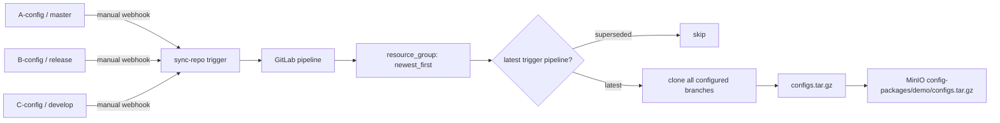

# GitLab Config Repositories → MinIO Sync PoC

這是一套可執行的 Self-Managed GitLab PoC。多個 private config repositories 的 push webhook 觸發中央 `sync-repo`；中央 pipeline 使用 reusable CI/CD Component，每次重新抓取所有指定 branch 的最新內容、封裝成單一 `tar.gz`，再上傳 MinIO。

## Architecture



固定版本集中在 `.env.example`：GitLab CE `17.11.7-ce.0`、GitLab Runner `17.11.2`、MinIO `RELEASE.2025-04-22T22-12-26Z`、MinIO Client `RELEASE.2025-04-16T18-13-26Z`。GitLab 17.11 支援 `spec:inputs`、CI/CD Catalog Components 與 `include:component`。

## Prerequisites

- Linux Docker Engine + Docker Compose v2（Runner 會掛載 `/var/run/docker.sock`）
- 至少 4 CPU、8 GB RAM、約 20 GB 可用空間
- `git`, `curl`, `jq`, `openssl`, `make`
- host ports `8929`, `2224`, `9000`, `9001` 未被占用

## Start

```bash
cp .env.example .env
# 請先將 .env 內所有範例 password / secret 換成自己的強隨機值
make up
make bootstrap
```

第一次啟動 GitLab 通常需要 5–10 分鐘。所有資料使用 named persistent volumes。`make bootstrap` 可重複執行；本機產生的 token 保存在被 gitignore 的 `.state/`。若刪除 volumes，也應一併移除 `.state/` 後重新 bootstrap。

## URLs and Login

- GitLab: <http://localhost:8929>
- MinIO API: <http://localhost:9000>
- MinIO Console: <http://localhost:9001>
- GitLab login: `root` / `.env` 的 `GITLAB_ROOT_PASSWORD`
- MinIO login: `.env` 的 `MINIO_ROOT_USER` / `MINIO_ROOT_PASSWORD`

若預設 port 已被占用，可在 `.env` 修改 `MINIO_API_PORT` / `MINIO_CONSOLE_PORT`；container network 與 pipeline endpoint 仍固定使用 `minio:9000`，不受 host port 影響。

Bootstrap 使用 `gitlab-rails runner` 產生一次性的 root API token，只用於建立 groups/projects/scoped tokens/Runner，絕不放入 pipeline。可在完成後於 GitLab UI 撤銷 `poc-bootstrap`；若還要重跑 bootstrap，先刪除 `.state/admin-token` 以建立新 token。

## Demo and Verify

```bash
make demo       # 三段完整 demo，包含 batch skip log 驗證
make verify     # 驗證目前 MinIO archive 結構與沒有 .git
```

Demo 1 將 A/B/C 重設為 `1/1/1` 並同步；Demo 2 更新 A 為 2；Demo 3 快速推送與 trigger `A3, B2, C2, A4`，最後驗證 `4/2/2`，並從 job trace 確認至少一個舊 pipeline 出現 `Newer sync pipeline exists`。

## Consumer Usage

團隊的 consumer repository 只需：

```yaml
include:
  - component: $CI_SERVER_FQDN/platform/ci-components/config-sync@1.0.0
    inputs:
      repositories: |
        demo-configs/A-config|master
        demo-configs/B-config|release
        demo-configs/C-config|develop
      minio_bucket: config-packages
      minio_object: demo/configs.tar.gz

stages: [deploy]
```

Component inputs 還有 `output_name`（`configs.tar.gz`）、`resource_group`（`config-sync`）與 `batch_delay_seconds`（`5`）。敏感資料不是 inputs。

## Manual Webhook Setup

`make bootstrap` 最後會印出包含 trigger token 的 URL。到每個 config project 的 **Settings → Webhooks → Add new webhook**，貼上該 URL、只選 **Push events**，並設定 branch filter：

| Project | Branch filter | Webhook URL |
|---|---|---|
| `demo-configs/A-config` | `master` | bootstrap 輸出的 URL |
| `demo-configs/B-config` | `release` | bootstrap 輸出的 URL |
| `demo-configs/C-config` | `develop` | bootstrap 輸出的 URL |

URL 形式為 `http://localhost:8929/api/v4/projects/<id>/ref/main/trigger/pipeline?token=<token>`。若 GitLab container 無法回連 host 的 `localhost`，在 Webhook URL 使用 GitLab 可到達的正式 hostname；pipeline 內部則已使用 Docker DNS `gitlab:8929` 與 `minio:9000`。本 PoC 刻意不自動建立 webhooks。

## How Batch Works

所有同步 job 共用 `resource_group: config-sync`，bootstrap 用 GitLab API 將其真實 `process_mode` 設成 `newest_first`（沒有虛構 YAML syntax）。Job 取得 lock 後先等待 `batch_delay_seconds`，再以 scoped `read_api` token 查詢同 ref 最新的 trigger pipeline。若 ID 比自己新，就成功結束而不 clone、tar、upload；最新 pipeline 才抓取全部 repositories。因此等待佇列優先執行最新工作，較舊工作之後快速 skip，最後物件必然反映最新三個 branch 狀態。

## Credentials

| Variable | Purpose / scope |
|---|---|
| `CONFIG_GITLAB_URL` | Runner/job 使用的 Docker DNS URL `http://gitlab:8929`，避免錯用 container 內的 localhost |
| `CONFIG_GIT_USERNAME`, `CONFIG_GIT_TOKEN` | `demo-configs` Group Deploy Token，只有 `read_repository` |
| `SYNC_API_TOKEN` | `sync-repo` Project Access Token，Reporter + `read_api`，只查 pipeline；Reporter 是可靠讀取 private project pipeline API 的最低 project role |
| `MINIO_ENDPOINT` | Runner network URL `http://minio:9000`，非 secret |
| `MINIO_ACCESS_KEY`, `MINIO_SECRET_KEY` | MinIO 專用 user，只能 list bucket 與 get/put `config-packages/*` |

Secret variables 由 bootstrap API 建立並設為 Masked；不 commit、不印到 job log。PoC main branch 未設 protected，因此 variables 不是 Protected；production 應保護 default branch 後將 variables 設為 Protected。

## Error Handling

Component 會明確 fail：錯誤的 `namespace/project|branch` 格式、空清單、重複 repo basename、不存在的 project/branch、clone auth 問題、GitLab API 非 200/無資料、MinIO auth/連線/bucket/upload 問題。只有確認存在較新 trigger pipeline 才 `exit 0`。Archive 保留 repository basename，並在上傳前檢查不包含 `.git`。

## Repository Layout

```text
repositories/ci-components/templates/config-sync.yml
repositories/A-config/configs/a.yaml
repositories/B-config/configs/b.yaml
repositories/C-config/configs/c.yaml
repositories/sync-repo/.gitlab-ci.yml
scripts/{start,bootstrap,demo,verify,...}.sh
```

## Known Limitations

- GitLab 啟動耗用較多 CPU/RAM；本機 Docker socket Runner 僅適合隔離的 PoC host。
- HTTP 與 `.env` secrets 只適合本機 PoC；production 必須用可信 HTTPS、Vault/外部 secrets manager、定期 rotate tokens。
- External URL 與 container network hostname 不同；正式環境應使用所有節點可解析的統一 DNS。
- `newest_first` 不會取消已開始的 job；latest check 讓已 supersede 的 job跳過昂貴工作，但在它檢查後才到的新 trigger 仍可能讓該次同步完成。後續最新 job 會再次同步，最終狀態正確。
- Webhook branch filters 必須依上節手動設定；Demo 直接呼叫同一 Pipeline Trigger API 模擬 webhook。
