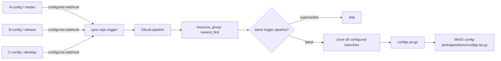

# GitLab Config Repositories → MinIO Sync PoC

這是一套可執行的 Self-Managed GitLab PoC。多個 private config repositories 的 push webhook 觸發中央 `sync-repo`；中央 pipeline 使用 reusable CI/CD Component，每次重新抓取所有指定 branch 的最新內容、封裝成單一 `tar.gz`，再上傳 MinIO。

## Architecture



固定版本集中在 `.env.example`：GitLab CE `17.11.7-ce.0`、GitLab Runner `17.11.2`、MinIO `RELEASE.2025-04-22T22-12-26Z`、MinIO Client `RELEASE.2025-04-16T18-13-26Z`。GitLab 17.11 支援 `spec:inputs`、CI/CD Catalog Components 與 `include:component`。

## Prerequisites

- Linux Docker Engine + Docker Compose v2（Runner 會掛載 `/var/run/docker.sock`）
- 至少 4 CPU、8 GB RAM、約 20 GB 可用空間
- `git`, `curl`, `jq`, `openssl`, `make`
- host ports `8929`, `2224`, `9000`, `9001` 未被占用

## Start

```bash
cp .env.example .env
# 請先將 .env 內所有範例 password / secret 換成自己的強隨機值
make up
make bootstrap
```

第一次啟動 GitLab 通常需要 5–10 分鐘。所有資料使用 named persistent volumes。`make bootstrap` 可重複執行；本機產生的 token 保存在被 gitignore 的 `.state/`。若刪除 volumes，也應一併移除 `.state/` 後重新 bootstrap。

## URLs and Login

- GitLab: <http://localhost:8929>
- MinIO API: <http://localhost:9000>
- MinIO Console: <http://localhost:9001>
- GitLab login: `root` / `.env` 的 `GITLAB_ROOT_PASSWORD`
- MinIO login: `.env` 的 `MINIO_ROOT_USER` / `MINIO_ROOT_PASSWORD`

若預設 port 已被占用，可在 `.env` 修改 `MINIO_API_PORT` / `MINIO_CONSOLE_PORT`；container network 與 pipeline endpoint 仍固定使用 `minio:9000`，不受 host port 影響。

### Reset and verify the GitLab root password

使用 GitLab 的互動式 password reset task。這個命令需要終端輸入：

```bash
docker compose exec gitlab \
  gitlab-rake "gitlab:password:reset[root]"
```

GitLab Rails environment 載入可能需要 1–2 分鐘；等待提示出現後輸入兩次新密碼。輸入時終端不會回顯字元，成功時會顯示：

```text
Password successfully updated for user with username root.
```

也可以先進入 container，再執行相同 task：

```bash
docker compose exec gitlab bash
gitlab-rake "gitlab:password:reset[root]"
exit
```

新密碼至少使用 16 字元，並避免 `ChangeMe`、`Password`、帳號名稱等常見組合。完成後以 `root` 登入 <http://localhost:8929> 驗證，並同步更新 host 的 `.env`：

```dotenv
GITLAB_ROOT_PASSWORD='剛設定的新密碼'
```

若密碼包含 `$`、空白或 `#`，請保留單引號。重設 root 登入密碼不會撤銷 Group Deploy Token、Project Access Token、Pipeline Trigger Token、Runner authentication token 或 MinIO credentials；這些 credential 各自管理，只有被 revoke、刪除、到期或其所屬資源被移除時才會失效。

Bootstrap 使用 `gitlab-rails runner` 產生只供 bootstrap 使用的 root API token，用於建立 groups/projects/scoped tokens/Runner，絕不放入 pipeline。Token 會保存在被 gitignore 的 `.state/admin-token`，直到被撤銷或到期；可在完成後於 GitLab UI 撤銷 `poc-bootstrap`。若還要重跑 bootstrap，先刪除 `.state/admin-token` 以建立新 token。

## Demo and Verify

```bash
make demo       # 三段完整 demo，包含 batch skip log 驗證
make verify     # 驗證目前 MinIO archive 結構與沒有 .git
```

Demo 1 將 A/B/C 重設為 `1/1/1` 並同步；Demo 2 更新 A 為 2；Demo 3 快速推送與 trigger `A3, B2, C2, A4`，最後驗證 `4/2/2`，並從 job trace 確認至少一個舊 pipeline 出現 `Newer sync pipeline exists`。

## Consumer Usage

團隊的 consumer repository 只需：

```yaml
include:
  - component: $CI_SERVER_FQDN/platform/ci-components/config-sync@1.0.0
    inputs:
      repositories: |
        demo-configs/A-config|master
        demo-configs/B-config|release
        demo-configs/C-config|develop
      minio_bucket: config-packages
      minio_object: demo/configs.tar.gz

stages: [deploy]
```

Component inputs 還有 `output_name`（`configs.tar.gz`）、`resource_group`（`config-sync`）與 `batch_delay_seconds`（`5`）。敏感資料不是 inputs。

## Manual Webhook Setup

`make bootstrap` 最後會印出 `SYNC_REPO_PROJECT_ID`、`TRIGGER_TOKEN` 和完整 webhook URL。若之後需要重新取得這兩個值，優先從 GitLab UI 查詢：

1. 開啟 `demo-sync/sync-repo` project。
2. `SYNC_REPO_PROJECT_ID`：在 project 首頁名稱下方，或 **Settings → General** 的 Project ID 欄位查看並複製數字 ID。
3. `TRIGGER_TOKEN`：進入 **Settings → CI/CD → Pipeline triggers**，展開該區段，找到 bootstrap 建立且描述為 `config-repository-webhooks` 的 trigger，再複製其 token。

若 UI 因權限或版本只顯示部分 token，可在執行 bootstrap 的 host 從受保護且被 gitignore 的狀態檔取得：

```bash
sed -n 's/^SYNC_REPO_PROJECT_ID=//p' .state/runtime.env
sed -n 's/^TRIGGER_TOKEN=//p' .state/runtime.env
```

`TRIGGER_TOKEN` 等同密碼：不要 commit、貼到 issue、分享終端輸出或放入一般文件。若 token 已遺失且無法從 UI 或 `.state/runtime.env` 取得，請在 **Pipeline triggers** 建立新 trigger，更新三個 webhook URL，然後刪除舊 trigger。

組合 webhook URL：

```text
http://gitlab:8929/api/v4/projects/<SYNC_REPO_PROJECT_ID>/ref/main/trigger/pipeline?token=<TRIGGER_TOKEN>
```

建立 webhook 時必須遮罩 URL 中的 Trigger Token：

1. 到 config project 的 **Settings → Webhooks → Add new webhook**。
2. 在 **URL** 貼上包含真實 Trigger Token 的完整 URL。
3. 選取 **Mask portions of URL**（部分版本顯示 **Add URL masking**）。
4. 在 **Sensitive portion of URL** 只貼 Trigger Token 本身，不包含 `token=`。
5. 在 **How it looks in the UI** 輸入 `trigger_token`。
6. 確認 URL preview 顯示 `token={trigger_token}`，不再顯示真實 token。
7. 只選 **Push events**、設定下表 branch filter，然後儲存。

GitLab 執行 webhook 時會用真正 token 取代 placeholder；遮罩部分不會出現在 GitLab UI 或 logs，並會在 GitLab database 中加密保存。不要使用真實 token 作為顯示名稱，也不要將含真實 token 的完整 URL 留在 README、issue、截圖或聊天記錄中。

三個 repository 分別設定：

| Project | Branch filter | Webhook URL |
|---|---|---|
| `demo-configs/A-config` | `master` | bootstrap 輸出的 URL |
| `demo-configs/B-config` | `release` | bootstrap 輸出的 URL |
| `demo-configs/C-config` | `develop` | bootstrap 輸出的 URL |

URL masking 降低 token 從 UI、logs 或 database 洩漏的風險，但實際 HTTP request 仍需攜帶 token。本 PoC 的流量只走隔離的 Docker network；production 必須改用可信 HTTPS，並定期 rotate token。

Webhook 是由 GitLab container 送出，因此 URL 必須使用 Docker DNS `gitlab:8929`，不能使用 `localhost:8929`。在 container 中，`localhost` 可能解析成 `::1`，造成 `Failed to open TCP connection to ::1:8929`。若 GitLab 顯示 local network request 被阻擋，請以管理員進入 **Admin Area → Settings → Network → Outbound requests**，允許 webhooks and integrations 存取 local network，然後重新測試。Pipeline 內部同樣使用 Docker DNS `gitlab:8929` 與 `minio:9000`。本 PoC 刻意不自動建立 webhooks。

每個 webhook 儲存後使用 **Test → Push events** 驗證。**Recent events** 應顯示 HTTP `201`，response JSON 應包含新建 pipeline 的 `id`；接著到 `demo-sync/sync-repo` 的 **Build → Pipelines** 確認同一個 ID。

## End-to-end Monitoring

完整資料流如下：

```text
config repository push
→ webhook delivery
→ sync-repo pipeline
→ GitLab Runner job
→ MinIO object
```

### 1. Webhook delivery

進入 config project 的 **Settings → Webhooks**，點開 webhook 並查看 **Recent events**。每筆 delivery 可檢查 HTTP status、request、response、耗時和錯誤內容，也可使用 **Test → Push events** 主動測試。

成功呼叫 Pipeline Trigger API 應回傳 HTTP `201`，response JSON 會包含新 pipeline 的 `id`。常見錯誤：

| Result | Meaning / action |
|---|---|
| `201` | Pipeline trigger 建立成功；記下 response 的 pipeline ID |
| `400` | ref、request 格式或 trigger 設定有誤 |
| `401` | Trigger Token 無效或已撤銷 |
| `404` | `SYNC_REPO_PROJECT_ID` 或 URL path 錯誤 |
| connection refused to `::1:8929` | URL 錯用了 `localhost`；改成 `http://gitlab:8929/...` |
| Runner 在 `Getting source from Git repository` 連不到 `localhost:8929` | 執行 `./scripts/register-runner.sh`，使 Runner 的 `clone_url` 使用 `http://gitlab:8929`；瀏覽器入口仍維持 `http://localhost:8929` |
| local network blocked | 在 Admin Area 允許 webhook outbound request 存取 local network |

### 2. Pipeline and job

進入 `demo-sync/sync-repo` 的 **Build → Pipelines**，以 webhook response 的 pipeline ID 找到同一次執行。常見中間狀態包括 `created`、`pending`、`waiting_for_resource`、`running`，最後應成為 `success`；`failed` 表示需要查看 job log。

點入 pipeline 的 `config-sync` job 查看 log。成功同步應包含：

```text
[config-sync] This is the latest pipeline. Continue.
[config-sync] Sync demo-configs/A-config @ master
[config-sync] Sync demo-configs/B-config @ release
[config-sync] Sync demo-configs/C-config @ develop
[config-sync] Upload: s3://config-packages/demo/configs.tar.gz
[config-sync] Done
```

若 pipeline 已被較新的 trigger supersede，正常結果是：

```text
[config-sync] Newer sync pipeline exists.
[config-sync] Skip this pipeline.
```

### 3. GitLab Runner

GitLab UI 的 **Admin Area → CI/CD → Runners** 中，`poc-docker-runner` 應顯示 online。Host 上可執行：

```bash
docker compose ps
docker compose exec -T gitlab-runner gitlab-runner verify
docker compose logs --tail=100 gitlab-runner
```

需要持續追蹤時使用：

```bash
docker compose logs -f gitlab-runner
```

若 pipeline 長時間停在 `pending`，優先確認 Runner 是否 online、registration 是否有效，以及 Docker executor 是否能建立 job container。

### 4. MinIO object

登入 <http://localhost:9001>，進入 **Object Browser → config-packages → demo → configs.tar.gz**，檢查 Last Modified、Size 和 ETag。每次真正執行 upload 的 pipeline 成功後，Last Modified 應更新；被 supersede 而 skip 的 pipeline 不會更新物件。

從 host 驗證 archive 結構及 `.git` 排除：

```bash
make verify
```

也可指定預期的 A/B/C version：

```bash
./scripts/verify.sh 4 2 2
```

排查時應以同一個 pipeline ID 串起 webhook response、Pipeline UI、job log，最後再確認 MinIO Last Modified 與 archive 內容。

## How Batch Works

所有同步 job 共用 `resource_group: config-sync`，bootstrap 用 GitLab API 將其真實 `process_mode` 設成 `newest_first`（沒有虛構 YAML syntax）。Job 取得 lock 後先等待 `batch_delay_seconds`，再以 scoped `read_api` token 查詢同 ref 最新的 trigger pipeline。若 ID 比自己新，就成功結束而不 clone、tar、upload；最新 pipeline 才抓取全部 repositories。因此等待佇列優先執行最新工作，較舊工作之後快速 skip，最後物件必然反映最新三個 branch 狀態。

## Credentials

| Variable | Purpose / scope |
|---|---|
| `CONFIG_GITLAB_URL` | Runner/job 使用的 Docker DNS URL `http://gitlab:8929`，避免錯用 container 內的 localhost |
| `CONFIG_GIT_USERNAME`, `CONFIG_GIT_TOKEN` | `demo-configs` Group Deploy Token，只有 `read_repository` |
| `SYNC_API_TOKEN` | `sync-repo` Project Access Token，Reporter + `read_api`，只查 pipeline；Reporter 是可靠讀取 private project pipeline API 的最低 project role |
| `MINIO_ENDPOINT` | Runner network URL `http://minio:9000`，非 secret |
| `MINIO_ACCESS_KEY`, `MINIO_SECRET_KEY` | MinIO 專用 user，只能 list bucket 與 get/put `config-packages/*` |

Secret variables 由 bootstrap API 建立並設為 Masked；不 commit、不印到 job log。PoC main branch 未設 protected，因此 variables 不是 Protected；production 應保護 default branch 後將 variables 設為 Protected。

`EPS/template-pipeline` 範例使用的七個 Group CI/CD Variables，包含
Masked and hidden、Protected、Expand variable reference 與 Group/Project
scope 的逐項建議，記錄於 [minio-sync-repos/README.md](minio-sync-repos/README.md#recommended-variable-settings)。

## Error Handling

Component 會明確 fail：錯誤的 `namespace/project|branch` 格式、空清單、重複 repo basename、不存在的 project/branch、clone auth 問題、GitLab API 非 200/無資料、MinIO auth/連線/bucket/upload 問題。只有確認存在較新 trigger pipeline 才 `exit 0`。Archive 保留 repository basename，並在上傳前檢查不包含 `.git`。

## Repository Layout

```text
repositories/ci-components/templates/config-sync.yml
repositories/A-config/configs/a.yaml
repositories/B-config/configs/b.yaml
repositories/C-config/configs/c.yaml
repositories/sync-repo/.gitlab-ci.yml
scripts/{start,bootstrap,demo,verify,...}.sh
```

## Known Limitations

- GitLab 啟動耗用較多 CPU/RAM；本機 Docker socket Runner 僅適合隔離的 PoC host。
- HTTP 與 `.env` secrets 只適合本機 PoC；production 必須用可信 HTTPS、Vault/外部 secrets manager、定期 rotate tokens。
- External URL 與 container network hostname 不同；正式環境應使用所有節點可解析的統一 DNS。
- `newest_first` 不會取消已開始的 job；latest check 讓已 supersede 的 job跳過昂貴工作，但在它檢查後才到的新 trigger 仍可能讓該次同步完成。後續最新 job 會再次同步，最終狀態正確。
- Webhook branch filters 必須依上節手動設定；Demo 直接呼叫同一 Pipeline Trigger API 模擬 webhook。
